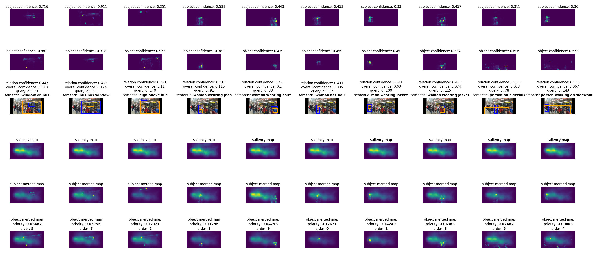

# PerSF-SemCom: Personalized Saliency-Based Semantic Communication

TODO: INTRODUCTION TO THIS WORK.

## Requirements

* nvidia-docker
* cuda>=10.0

## Quick Start

### Option 1 (Recommend): Download prebuilt docker image
The authors have encapsulated the development environment, all the 
required python packages, code and data into a docker image, which 
is open available on DockerHub, to help reproduce our experiment 
environment quickly. (Note that the image size is relatively large, 
it takes about 11.7GB of space on the disk.)

**1. Pull docker image from DockerHub:**
> $ sudo docker pull lizonghango00o1/persf-semcom:tf-cpu1.13.1-torch-gpu1.6.0-cuda10.0

**2. Run a container from the image:**
> $ sudo docker run -dit --name persf-semcom --gpus all lizonghango00o1/persf-semcom:tf-cpu1.13.1-torch-gpu1.6.0-cuda10.0

**3. Enter the container and run PerSF-SemCom:**
> $ sudo docker exec -ti persf-semcom bash \
> (persf-semcom) $ python -W ignore main.py \
> Personalized query text: {0: 'woman has hair', 1: 'sign on building', 2: 'woman wearing shirt'} \
> (Wait a few minutes for simulating the multipath fading channel ...) \
> [Bargain:schedule+alpha0.2] Best power allocation (ratio): [0.40640748 0.18427428 0.40010618] \
> [Bargain:schedule+alpha0.2] Best scores: [0.45763, 0.11525, 0.3322] \
> [Bargain:schedule+alpha0.2] Best target: 0.0175208450615 

Default setting: Total transmitter power 3kW, number of users is 3, 
fusion coefficient alpha=0.2. Multiprocessing is default enabled for
acceleration.

### Option 2: Build image from Dockerfile
For a more flexible and lightweight refactoring of our experiment 
environment, we provide a Dockerfile to help rebuild the docker image.

**1. Clone this Git repository.**

**2. Download the [pretrained RelTR weights](https://drive.google.com/file/d/1id6oD_iwiNDD6HyCn2ORgRTIKkPD3tUD/view) and put it under ``RelTR/ckpt/``.**

**3. Put custom data files under ``data/custom_data/data/``.**

**4. Build the docker image.**

This Dockerfile requires CUDA>=10.0 on the host machine, and it will
copy all files to the image.

> $ sudo docker build -f Dockerfile -t persf-semcom:tf-cpu1.13.1-torch-gpu1.6.0-cuda10.0 . \
> $ sudo docker run -dit --name persf-semcom --gpus all persf-semcom:tf-cpu1.13.1-torch-gpu1.6.0-cuda10.0 \
> (container) $ python -W ignore main.py --input_dir data/custom_data/data --output_dir data/custom_data/output --resume_pkl 0

This will load images from ``input_dir`` and save output to ``output_dir``, 
including the outputs of RelTR and Saliency in pickle format, and the 
visualization figures of AttnFusion (An example: the visualization output 
of user 1 is shown below). Set ``--resume_pkl=1`` to reuse preprocessed outputs.

You can also mount the data directory to the container, using the ``-v`` 
option, for example,

> $ sudo docker run -dit --name persf-semcom --gpus all -v {PATH_TO_PROJECT}/data:/root/data persf-semcom:tf-cpu1.13.1-torch-gpu1.6.0-cuda10.0

## Other options

**1. Specify one custom image to visualize**
> (container) $ python -W ignore main.py --input_dir data/{CUSTOM_DIR}/data --img_name {CUSTOM_IMG}.jpg --output_dir data/{CUSTOM_DIR}/output --resume_pkl 0 --repeat_exp 0

This will visualize the AttnFusion output of this custom image, the figure
is saved in ``--output_dir``.

**2. Customize GPU/CPU for RelTR and Saliency preprocessing**

By default, we run RelTR inference on GPU 0 and others on CPU. You can use
``--device_reltr=cpu`` to run RelTR on CPU. In this case, the requirement
of CUDA on the host machine is not required. Otherwise, we can set 
``--device_reltr=cuda:1`` to run RelTR on other GPUs, similarly, set 
``--device_saliency=gpu:1`` to run Saliency on GPU 1. RelTR and Saliency 
are not recommended to use the same CPU. Note that these options only take 
effect when ``--resume_pkl=0``.

**3. Processing a custom dataset for the first time**

If we process a dataset for the first time, we need to turn off 
``--resume_pkl=0``. This will generate ``.pkl`` files for each image, and
visualize the outputs of AttnFusion module. The output files are saved in
``--output_dir``.

**4. Change packet drop mode and transmitter power**

We provide 3 drop modes, named ``no_drop, random_drop, schedule`` in this
implementation.

* no_drop: No packets will get dropped, corresponding to the case where 
  the transmitter power is infinity.
* random_drop: For each user, their triplets will be dropped with equal 
  probability. 
* schedule: For each user, their triplets will be allocated transmitter 
  power proportional to their priority.

For our approaches Naive-SemCom, OA-SemCom, PerSF-SemCom, and the case
of infinite power, use the following commands.

For Naive-SemCom (i.e., the transmitter power is evenly allocated among 
users, and for each user, the power is also evenly allocated):

> (container) $ python -W ignore main.py --drop_mode random_drop --use_bargain 0

For OA-SemCom (i.e., a special case of fusion coefficient alpha=1 in 
PerSF-SemCom):

> (container) $ python -W ignore main.py --drop_mode schedule --use_bargain 1 --alpha 1.0

For PerSF-SemCom (i.e., the proposed subjective-objective fusion approach,
the default fusion coefficient is alpha=0.2):

> (container) $ python -W ignore main.py --drop_mode schedule --use_bargain 1 

For the approaches above, we can use ``--alpha`` to tune the fusion 
coefficient and ``--power`` to tune the total transmitter power.

For the case of infinite power (i.e., the theoretical upper bound):

> (container) $ python -W ignore main.py --drop_mode no_drop --use_bargain 0

**5. Change the number of repeated experiments**

The default repeat number is 5, you can use ``--repeat_exp`` to set it 
to an another integer.

**6. Hyperparameters of RCGA algorithm**

The default setting is as follows: ``--size_pop=50``, ``--max_iter=20``,
``--prob_mut=0.001``, ``--comp_mode=multiprocessing``. ``comp_mode`` 
supports 3 modes, "multiprocessing", "multithreading" and "common".
We recommend using multiprocessing to accelerate RCGA.

# Acknowledgements
PerSF-SemCom uses [RelTR](https://github.com/yrcong/RelTR) and 
[Saliency](https://github.com/alexanderkroner/saliency) as attention
backends, and [TextMatch](https://github.com/MachineLP/TextMatch) as
score estimation, and [scikit-opt](https://github.com/guofei9987/scikit-opt)
as RCGA core. We sincerely thank them for their work that underpins this research.